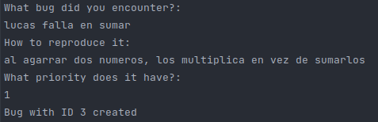
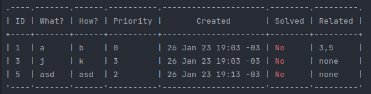
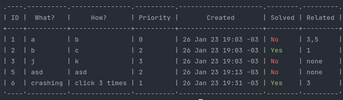

# CLI Bug tracker
Bug Tracker made in Go using Cobra.

[](https://github.com/faculerena/bugtracker/actions/workflows/main.yml)
# About the tracker
Small CLI app to track bugs, you can:

* **ADD** new bugs to track
* Mark as **SOLVED** an existing bug
* Create a **NOTE** for an existing bug
* **DELETE** saved bugs, or **DELETEALL** solved bugs
* **CLEAR** the tracker
* **RELATE** a bug with another (one to many)
  * You can use **RELATED <id>** to retrieve all the bugs related to an ID (including itself)
* **REOPEN** a solved bug
* **LIST** all bugs, or **LIST <n> [k]** to retrieve the last <n> saved bugs or the interval [n, k] bugs

# Save
For now, all the bugs are stored in .json format in home dir in a file named ".tracker.json"
The next usable id is saved there too on a ".id" file. I will make this a better way.


# How to install

With Go ver 1.19.5 you can:

Build the file

``make build``

Then run it as 

```./tracker [cmd]```

# Images

```add``` asks for "what", "how", and "priority"



```list``` retrieves unsolved bugs



```listall``` retrieves all bugs

 

